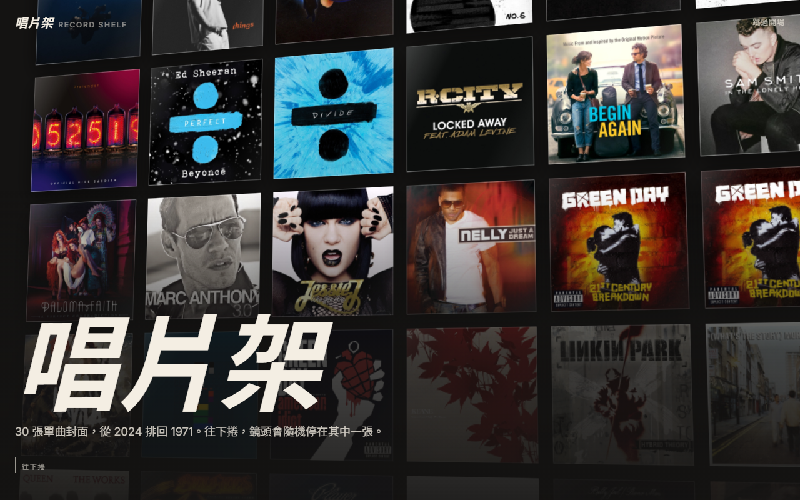
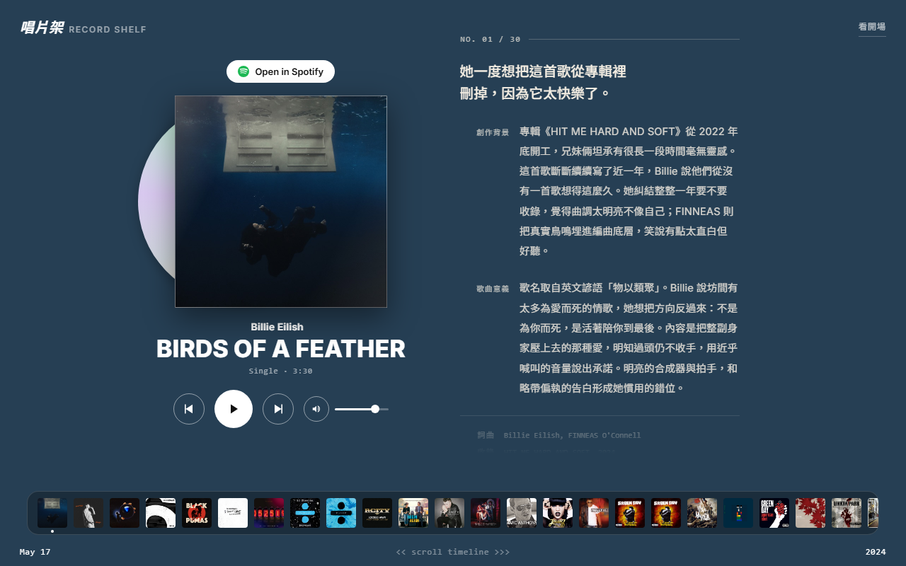

# record-shelf — 唱片架

把你實際擁有的單曲做成一頁唱片牆。點封套抽出唱片、播 30 秒試聽、
背景色跟著封面走；寫了內頁的歌，右側翻開唱片內頁。

靜態 HTML，零框架、零 build，資料只有一個檔。




Demo（我自己的 30 首）：https://record-shelf-nine.vercel.app
＋捲動開場 [/intro.html](https://record-shelf-nine.vercel.app/intro.html)。

English: [README.md](README.md)

## 做成你自己的

```
git clone https://github.com/Chen931222/record-shelf.git my-shelf
cd my-shelf
cp data.starter.js data.js        # 從空架子開始
rm covers/*.jpg                   # 那些是我的封面，抓你自己的
npm install                       # 只有一個依賴，取封面主色用
node scripts/add-song.mjs "Ed Sheeran" "Shape of You"
node scripts/add-song.mjs "Queen" "Bohemian Rhapsody"
python -m http.server 8533        # 任何靜態伺服器都行
```

開 http://localhost:8533 把每張封面看過一遍，然後到 `site.config.js`
換上你的站名。部署丟任何靜態空間都行：GitHub Pages（Settings → Pages
→ deploy from branch）或 `vercel --prod`。

## 加一首歌

`scripts/add-song.mjs` 查 iTunes Search API、下載 600px 封面到
`covers/<id>.jpg`、取封面主色壓暗當背景，依年份（新→舊）插進 `data.js`。

```
node scripts/add-song.mjs "歌手" "歌名" [--dry] [--country GB] [--pick N] [--force]
```

- `--dry` 只列候選跟算出來的顏色，不寫檔。
- `--country` 換國家商店。原版錄音室曲在美區常只掛專輯封面，同專輯兩首
  會撞同一張圖；換歌手母國商店（Ed Sheeran 用 `GB`）常撈得到正牌單曲封面。
- `--pick N` 選候選清單第 N 個，`--force` 覆蓋。

腳本測不出來的地雷：remix／acoustic 版的封面常直接把字印在圖上。
加完務必開站親眼看一次。

## 資料

全部在 `data.js`：`ALBUMS` 是牆（新→舊）；`NOTES` 是選填的唱片內頁，
key 對歌的 id，沒寫的歌顯示一行占位文案。每次加歌腳本會印出空的
NOTES 骨架讓你貼。

## 網頁版：做一面你的＋逛唱片牆（2026-09-24）

不會用 GitHub 的人走網頁：`/make.html` 搜歌（預設台灣 iTunes 商店）、放上去、每首寫一句話，
按「壓成一面牆」拿到公開連結 `/?w=<id>` 和一條私人編輯連結。`/walls.html` 逛所有人的牆。

- 不用註冊。編輯權就是那條編輯連結，伺服器只存它的雜湊。
- 伺服器發布時自己向 iTunes 再查一次，歌名、封面、試聽以 iTunes 為準；使用者只給曲目 ID、顏色、一句話、站名、署名。
- 公開牆用同一個播放器顯示（`boot.js` 決定資料來源，`app.js`／`intro.js` 不管資料打哪來）。
- 被三個不同來源檢舉會自動撤出展示牆（直連仍可看），站主再決定。

資料庫是 Upstash Redis，key 一律 `rs:` 前綴。Vercel 專案要有 `KV_REST_API_URL`／`KV_REST_API_TOKEN`
（或 `RS_` 前綴版）。沒接上時 API 回 503、頁面照實說「還沒開張」。

本機開發不需要金鑰：

```
node scripts/dev.mjs            # http://localhost:8533，資料存在 .dev-store.json
```

審核公開牆：

```
vercel env pull .env.local
node --env-file=.env.local scripts/admin.mjs recent      # 最近的牆和每一句話
node --env-file=.env.local scripts/admin.mjs reported    # 被檢舉的
node --env-file=.env.local scripts/admin.mjs hide <id>   # 隱藏；unhide 放回；delete 永久刪
```

## 站主自用備忘

- 部署用 `vercel --prod`（CLI 直傳工作區，非 git 自動部署）。
- 根目錄的 `singles*.json`／`previews*.json`／`itunes-raw*.json` 是當初
  抓資料的暫存，已被 `.vercelignore` 排除，改它們對線上沒有作用。

## 權利

程式碼 MIT（見 LICENSE）。封面圖與試聽音訊來自 iTunes Search API，
屬於各自的權利人。demo 資料裡的內頁文字是我寫的——換成你自己的。
